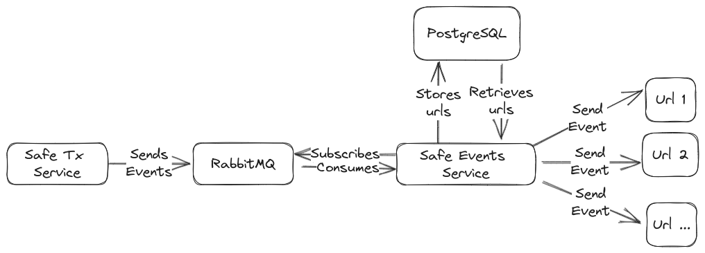

[](https://github.com/safe-global/safe-events-service/actions/workflows/ci.yml)
[](https://coveralls.io/github/safe-global/safe-events-service?branch=main)


# User documentation

## Description

Handle Safe indexing events from Transaction Service and deliver as HTTP webhooks.
This service should be connected to the [Safe Transaction Service](https://github.com/safe-global/safe-transaction-service):

- Transaction service sends events to RabbitMQ.
- Events service holds a database with services to send webhooks to, and some filters like `chainId` or `eventType` can be configured.
- Events service connects to RabbitMQ and susbscribes to the events. When an event matches filters for a service, a webhook is posted.



## Events supported

Some parameters are common to every event:

- `address`: Safe address.
- `type`: Event type.
- `chainId`: Chain id.

### Multisig Confirmation

```json
{
  "address": "<Ethereum checksummed address>",
  "type": "NEW_CONFIRMATION",
  "owner": "<Ethereum checksummed address>",
  "safeTxHash": "<0x-prefixed-hex-string>",
  "chainId": "<stringified-int>"
}
```

### MultisigTransaction (executed)

```json
{
  "address": "<Ethereum checksummed address>",
  "type": "EXECUTED_MULTISIG_TRANSACTION",
  "safeTxHash": "<0x-prefixed-hex-string>",
  "failed": <bool>,
  "txHash": "<0x-prefixed-hex-string>",
  "chainId": "<stringified-int>"
}
```

### MultisigTransaction (proposed, not executed)

```json
{
  "address": "<Ethereum checksummed address>",
  "type": "PENDING_MULTISIG_TRANSACTION",
  "safeTxHash": "<0x-prefixed-hex-string>",
  "chainId": "<stringified-int>"
}
```

### Incoming Ether

```json
{
  "address": "<Ethereum checksummed address>",
  "type": "INCOMING_ETHER",
  "txHash": "<0x-prefixed-hex-string>",
  "value": "<stringified-int>",
  "chainId": "<stringified-int>"
}
```

### Incoming/Outgoing token (ERC20)

```json
{
"address": "<Ethereum checksummed address>",
"type": "INCOMING_TOKEN" | "OUTGOING_TOKEN",
"tokenAddress": "<Ethereum checksummed address>",
"txHash": "<0x-prefixed-hex-string>",
"value": "<stringified-int>",
"chainId": "<stringified-int>"
}
```

### Incoming/Outgoing tokens (ERC721)

```json
{
"address": "<Ethereum checksummed address>",
"type": "INCOMING_TOKEN" | "OUTGOING_TOKEN",
"tokenAddress": "<Ethereum checksummed address>",
"txHash": "<0x-prefixed-hex-string>",
"tokenId": "<stringified-int>",
"chainId": "<stringified-int>"
}
```

# Developer documentation

## Installation

Node 18 LTS is required.

```bash
$ npm install
```

## Running the app

Docker compose is required to run RabbitMQ and Postgres

```bash
cp .env.sample .env

docker compose up -d

# development
$ npm run start

# watch mode
$ npm run start:dev

# production mode
$ npm run start:prod
```

## Test

```bash
cp .env.sample .env

docker compose up -d

# unit tests
$ npm run test

# e2e tests
$ npm run test:e2e

# test coverage
$ npm run test:cov
```

## Creating database migrations

By default, the local dockerized migrations database will be used (test should not be used as it doesn't use migrations).
To use a custom database for migrations, set `MIGRATIONS_DATABASE_URL` environment variable.

Remember to add the new database entities to `./src/datasources/db/database.options.ts`

```bash
bash ./scripts/db_generate_migrations.sh RELEVANT_MIGRATION_NAME
```

## Endpoints

Available endpoints:

- /health/ -> Check health for the service.
- /admin/ -> Admin panel to edit database models.
